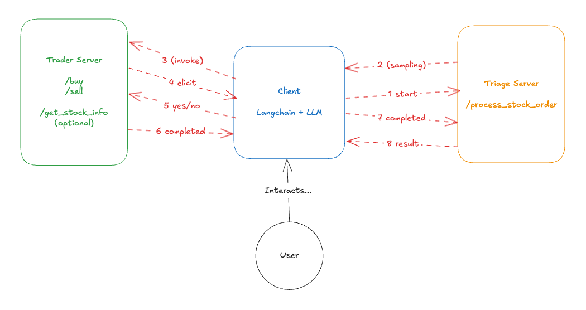

# LangChain + FastMCP Stock Trading Agent

This example demonstrates how to integrate FastMCP servers with LangChain to create an AI agent capable of stock trading operations.
It is an evolution of the agentic_flow example, this time using an LLM to coordinate the tool invocation

## Overview

The example consists of:
- **Triage Server**: Handles initial order processing and routing
- **Trader Server**: Executes buy/sell orders with user confirmation
- **LangChain Client**: AI agent that orchestrates trading operations. 

## Orchestration flow 


## Prerequisites

- Python 3.12+
- uv package manager
- Azure OpenAI API access (configured in `.env`)

## Setup

1. Ensure you have the required dependencies installed (handled by `uv`)
2. Configure your Azure OpenAI credentials in the `.env` file:
   ```
   AZURE_OPENAI_BASE_URL=your_endpoint_here
   AZURE_OPENAI_API_VERSION=2024-02-15-preview
   AZURE_OPENAI_DEPLOYMENT_NAME=your_model_deployment
   AZURE_OPENAI_API_KEY=your_api_key_here
   ```

## Running the Example

### Step 1: Start the MCP Servers

Open two separate terminals and run the servers:

**Terminal 1 - Triage Server (Port 8000):**
```bash
uv run triage_server.py
```

**Terminal 2 - Trader Server (Port 9000):**
```bash
uv run trader_server.py
```

Both servers should start and display their respective endpoints.

### Step 2: Launch the Client

In a third terminal, run the LangChain client:

```bash
uv run client.py
```

This will:
- Connect to both MCP servers
- Initialize the Azure OpenAI LLM
- Create LangChain tools from MCP server capabilities
- Start an interactive chat session

## Usage Examples

Once the client is running, you can interact with the AI agent using natural language:

```
👤 You: Buy 10 shares of MSFT
👤 You: Sell 5 shares of AAPL
👤 You: What is the value of Microsoft stocks? (test with and without the STOCK_INFO flag set.)
```

The agent will:
1. Process your request through the triage server
2. Route the order to the trader server
3. Request confirmation before executing trades
4. Provide feedback on the transaction

## Architecture

- **Triage Server**: Uses MCP sampling to delegate orders to the trader server
- **Trader Server**: Uses MCP elicitation to request user confirmation
- **LangChain Integration**: Wraps MCP tools as LangChain-compatible tools
- **Azure OpenAI**: Powers the conversational AI agent

## Available Files

- `triage_server.py`: MCP server for order processing
- `trader_server.py`: MCP server for trade execution
- `client.py`: LangChain client with manual tool wrappers
- `dynamic_client.py`: Enhanced client with automatic tool discovery

## Supported Stocks

The example is configured to trade:
- MSFT (Microsoft)
- AAPL (Apple)

Additional stocks can be added by modifying the server configurations.

## Additional test
Setting the variable `STOCK_INFO` of `trader_server` to true will add an additional tool that the client can use to 
ask the LLM about stock details and notice how it will now call the tool without any redirection.
The auto-discovery of new tools is not implemented, so you need to restart both server and client, can be a future improvement.

## Troubleshooting

- Ensure both servers are running before starting the client
- Check that ports 8000 and 9000 are available
- Verify Azure OpenAI credentials are correctly configured
- Use `verbose=True` in the agent configuration for detailed logging